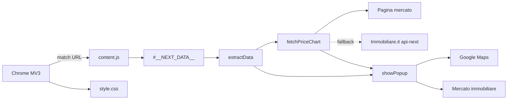

# Mappa tecnica

## Panoramica

L'estensione è un'iniezione statica lato pagina:



Non esistono service worker, popup di estensione, options page o backend del progetto. Il content script usa `localStorage` della pagina solo per preferenza tema e parametri mutuo.

## File e responsabilità

### `manifest.json`

- Manifest version: `3`.
- Match: `https://www.immobiliare.it/annunci/*`.
- Script iniettati: `content.js` e `style.css`.
- Permessi dichiarati: nessuno.

Il manifest non dichiara un service worker. L'esecuzione parte quindi dalla pagina compatibile, non da un contesto globale dell'estensione.

### `content.js`

Contiene tutto il comportamento applicativo:

| Area | Simboli | Ruolo |
| --- | --- | --- |
| Formattazione | `formatPrice`, `formatValue`, `formatDisponibilita` | Trasforma valori per la UI |
| Date | `formatUnixTimestampWithDays`, `dotColorBasedOnToday` | Mostra data e anzianità annuncio |
| Mercato | `formatCityName`, `fetchPriceChart`, `extractMarketPriceFromHtml` | Costruisce path e legge la media escludendo il range min/max |
| Collegamenti | `generateGoogleMapsLink` | Preferisce coordinate, poi indirizzo |
| Finanza | `calcolaRataMensile` | Calcola rata con ammortamento a rata costante |
| Estrazione | `extractData` | Legge Next.js data e prepara `info`, feature e link |
| Rendering/interazione | `showPopup` | Crea popup e registra eventi UI, tema e simulatori |

### `style.css`

Stilizza il container `#immobiliare-popup`, intestazione, blocchi informativi, indicatori colore, feature list e link. Il popup è `position: fixed`, inizialmente in alto a destra, con `z-index: 9999`.

La card **Spese condominiali** usa tono positivo per nessuna spesa o importi fino a 50 €, warning fino a 100 € e negativo oltre 100 €.

## Sequenza runtime

1. Chrome inietta i file quando l'URL soddisfa il match pattern.
2. `extractData()` cerca `#__NEXT_DATA__`; se assente termina senza UI.
3. Il testo dello script viene analizzato come JSON.
4. Il codice legge:

   ```text
   jsonData.props.pageProps.detailData.realEstate
   ```

5. `realEstate.properties[0]` fornisce i dettagli dell'immobile.
6. Vengono preparati:
   - campi informativi;
   - lista `props.ga4features`;
   - link Maps e mercato città.
7. `showPopup()` inserisce subito il popup base nel `document.body`.
8. `fetchPriceChart(region, city)` scarica prima la pagina mercato e `extractMarketPriceFromHtml()` cerca la media €/m², escludendo il range.
9. Se pagina mercato è assente o restituisce errore, il price-chart API viene usato come fallback.
10. Il valore zona, se disponibile, appare accanto a **Prezzo al m²** e determina il colore di confronto.
11. Gli handler gestiscono tema, minimizzazione, chiusura, drag e ricalcolo della rata proposta.

## Contratto dati osservato

Campi principali usati dal codice:

| Origine | Campi |
| --- | --- |
| `realEstate` | `createdAt`, `updatedAt`, `price.value`, `price.pricePerSquareMeter`, `properties` |
| `properties[0]` | `energy.class.name`, `energy.heatingType`, `energy.airConditioning`, `rooms`, `surface`, `availability`, `floor.floorOnlyValue`, `elevator`, `ga4Garage`, `buildingYear`, `costs.condominiumExpenses`, `ga4features` |
| `properties[0].location` | `latitude`, `longitude`, `address`, `streetNumber`, `city`, `province`, `nation.name`, `region` |
| API chart | array `labels` e array `values` non vuoti |

La struttura è fornita dal sito e non è un'API pubblica versionata. Ogni cambiamento di schema può richiedere un aggiornamento dell'estrattore.

## Richieste esterne

`fetchPriceChart()` costruisce un path comune per pagina mercato e API:

```text
GET https://www.immobiliare.it/mercato-immobiliare/<region>/<city>/
```

Invia `credentials: "include"`. Se la pagina non espone una media valida, usa API:

```text
GET https://www.immobiliare.it/api-next/city-guide/price-chart/1/?__lang=it&path=<encoded-market-path>
```

L'endpoint API viene richiesto solo se la pagina non espone una media valida.

`extractMarketPriceFromHtml()` cerca la media contestualizzata `€/m²` e ignora i valori dentro un intervallo `da ... a ...`; il contratto è coperto da `tests/market-page.fixture.html`. Il progetto non salva la risposta. I link UI portano a:

- `https://www.google.com/maps/dir/?api=1...`
- `https://www.immobiliare.it/mercato-immobiliare/<region>/<city>/`

## Calcolo rata e memoria locale

`calcolaRataMensile(valoreImmobile, tassoAnnuo = 0.04, anni = 30)` usa:

- capitale: `valoreImmobile * 0.95`;
- rate: `anni * 12`;
- tasso mensile: `tassoAnnuo / 12`;
- formula standard di ammortamento francese.

La funzione restituisce una stringa in formato valuta italiano, non un numero. L'importo proposta resta sempre visibile; percentuale mutuo, tasso annuo e durata sono modificabili nel collapse **Modifica parametri mutuo**.

I parametri vengono salvati localmente con chiave `immobiliare-insight-mortgage`. Il tema usa chiave `immobiliare-insight-theme` e accetta solo `light` o `dark`; in assenza di preferenza salvata segue il tema del sistema.

## Interazioni UI

- **Minimizza**: alterna `display: none/block` su `#popup-body`.
- **Tema**: il toggle nell'header alterna tema chiaro/scuro e aggiorna `localStorage`.
- **Trascina**: usa Pointer Events sull'header, con limiti viewport e supporto mouse/touch.
- **Proposta**: `#simulated-price`, percentuale, tasso e durata ascoltano `input`, aggiornano `#rata-mutuo-manuale` e salvano i parametri.
- **Link**: vengono aperti in nuova scheda con `noopener noreferrer`.

## Failure mode e limiti

- Senza `#__NEXT_DATA__`, `realEstate` o proprietà utili, `extractData()` termina senza mostrare il popup.
- `JSON.parse()` fallisce esplicitamente in console se JSON non è valido.
- `fetchPriceChart()` prova pagina mercato e API; se entrambi falliscono, il popup base resta visibile, confronto diventa N/D e box viene marcato missing.
- Il codice assume che `realEstate.properties[0]` esista.
- Il rendering usa nodi DOM e `textContent`; nuove superfici dati devono mantenere questo approccio.
- Le date Unix sono interpretate nel fuso locale del browser.
- `localStorage` può essere indisponibile in modalità privacy restrittiva; in quel caso l'estensione usa i default senza bloccare il popup.

Questi punti sono vincoli di manutenzione, non garanzie del sito sorgente.
